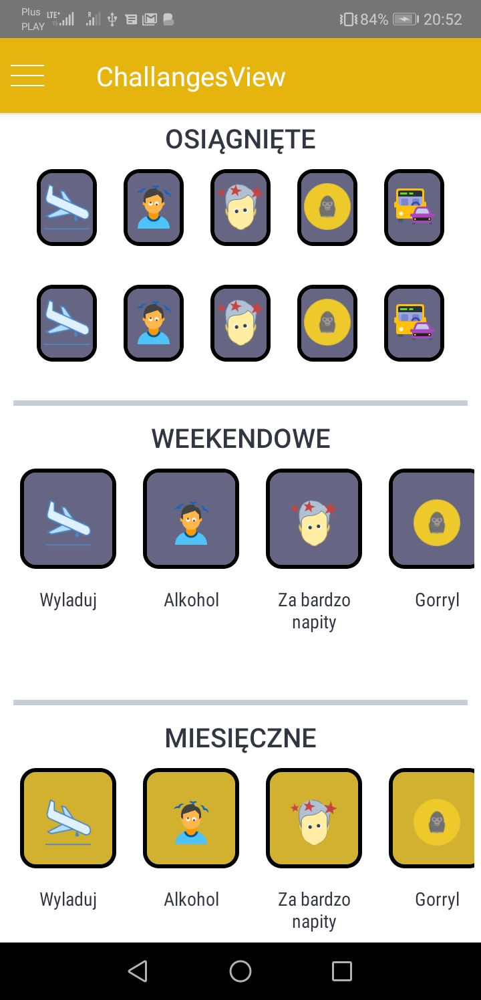

# DrinkApp :beers: :bridge_at_night:

The App is not finished, but I gained a lot of knowledge during writing this app. The app is written in React Native and is used Redux Structure. The App connected with the API which recived a data.

Description: The app informs people where the party is in this weekend and gives some coupons to the bars. The app gives the challenges and after doing them the player has better ranking level among city, country.

# View from The app
# Map View

# Bar View

# Take Coupons PopUp View

# Discount View

# Achievement View

